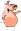
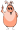
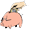

# Investporc 

[Releases](#releases)  
[Informations](#informations)  

## Releases
### 1.0.1 
This release fixes the important bug in formulas:
•	Cout de l’aliment gestation trop faible : somgespx =SI(naissage="oui"; ((cjag*(365-(nbcy*(aps+7)))*pag*nbt)+(cjag*365*nbv*pag)))

•	Cout annuel du cheptel: rac==SI(naissage="oui";(pat-prt)*(nbt*tauxrenouv/3);cte-(cte/dem)*nbcy)

•	Résultat DIVers : Ajouter * nbcy: div==SI(naissage="oui";((cd+(nbia*cia*nbcy))*nbt);cde*nbpoe)

## Informations
###  Analysez la viabilité de votre projet
L'outil permet de calculer le montant des investissements à consentir pour votre projet et le revenu espéré de l'activité.

###  Outils simple et complet
En quelques clics, cet outil vous aidera à chiffrer votre projet.

###  Pas trop vite !
Avant de débuter le calcul, nous vous conseillons de lire la page « Méthode » en vue de mieux comprendre l'outil.

# Méthode
Le site a été conçu au départ des recherches effectuées au CRA-W sur le porc en plein air, des nombreuses visites réalisées en ferme et des données obtenues au travers des Centres de Référence et d’Expérimentation en production de porcs en plein air subventionnés par la DGARNE.

Merci aux éleveurs de porcs qui ont partagé leurs données pour étayer ce travail et à Vincent Leroux, technicien au Centre d’économie Rurale de Marloie pour le temps consacré à la vérification des valeurs.

